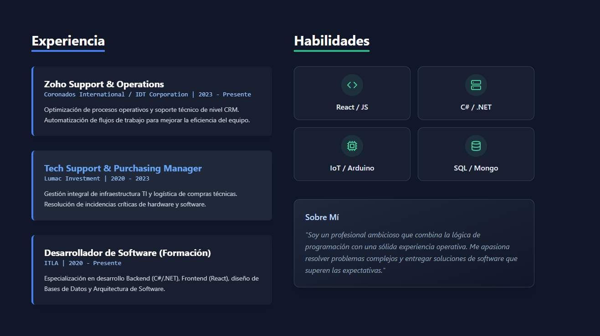

# 👨‍💻 Daniel Cabrera - Interactive Portfolio


Un portafolio web inmersivo y responsivo diseñado para mostrar experiencia en desarrollo Full Stack e IoT. Construido con un enfoque en rendimiento, animaciones fluidas y consumo de datos en tiempo real.

## 🚀 Demo en Vivo

Puedes ver el proyecto desplegado aquí:
**[🔗 Visitar Portafolio](https://portfolio-daniel.vercel.app)** 


---

## ✨ Características Principales

* **⚡ Rendimiento Ultra-rápido:** Desarrollado con **Vite** para una carga instantánea y optimización de recursos.
* **🎨 UI/UX Inmersiva:** Efectos **Parallax** y animaciones de entrada suaves utilizando **Framer Motion**.
* **📱 Diseño Responsivo:** Estilizado con **Tailwind CSS**, asegurando una visualización perfecta en móviles, tablets y escritorio.
* **🔄 Integración Dinámica con GitHub:** Conexión a la **GitHub REST API** para obtener y mostrar automáticamente mis repositorios más recientes y actualizados.
* **📂 Sección de Proyectos Destacados:** Exhibición curada de proyectos clave (Empresa II, Chatfire, Discord Bot, Nexum) con enlaces directos y detalles técnicos.
* **📄 Descarga de CV:** Acceso directo al currículum en formato PDF.

---

## 🛠️ Stack Tecnológico

Este proyecto utiliza las siguientes tecnologías y librerías:

* **Core:** [React](https://reactjs.org/) (Hooks, Functional Components)
* **Build Tool:** [Vite](https://vitejs.dev/)
* **Estilos:** [Tailwind CSS](https://tailwindcss.com/)
* **Animaciones:** [Framer Motion](https://www.framer.com/motion/)
* **Iconografía:** [Lucide React](https://lucide.dev/)
* **Data Fetching:** Native Fetch API (para GitHub)

---

## ⚙️ Instalación y Configuración Local

Si deseas clonar y ejecutar este proyecto localmente, sigue estos pasos:

1.  **Clonar el repositorio:**
    ```bash
    git clone [https://github.com/mandarinoazul/portfolio-v1.git](https://github.com/mandarinoazul/portfolio-v1.git)
    cd portfolio-v1
    ```

2.  **Instalar dependencias:**
    ```bash
    npm install
    ```

3.  **Iniciar el servidor de desarrollo:**
    ```bash
    npm run dev
    ```

4.  Abrir en el navegador:
    Visita `http://localhost:5173/` para ver la aplicación.

---

## 📂 Estructura del Proyecto

```text
/public
  ├── cv-daniel.pdf        # Archivo de Currículum
  ├── project-*.png        # Screenshots de proyectos destacados
/src
  ├── App.tsx              # Componente principal y lógica de negocio
  ├── index.css            # Configuración de Tailwind y estilos globales
  ├── main.tsx             # Punto de entrada de React
  └── ...
```
📬 Contacto
¿Te interesa mi perfil o quieres colaborar en un proyecto?

Email: danieleduardocabreraramirez@gmail.com

GitHub: @mandarinoazul

LinkedIn: [https://www.linkedin.com/in/daniel-eduardo-86829124b]

© 2026 Daniel Cabrera. Construido con pasión y código.
