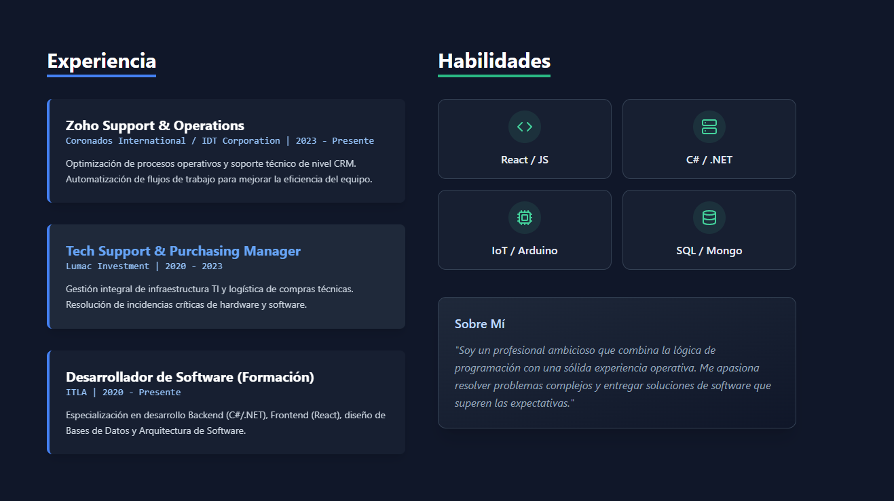

# Daniel Eduardo Cabrera Ramirez - Portfolio


An immersive and responsive web portfolio designed to showcase experience in Full Stack and IoT development. Built with a focus on performance, fluid animations, and real-time data consumption.

## Live Demo

You can view the deployed project here:
**[-> Visit Portfolio](https://portfolio-v2-alpha-rosy.vercel.app)**


---

## Main Features

* ** Lightning-Fast Performance:** Developed with **Vite** for instant loading and asset optimization.
* ** Immersive UI/UX:** **Parallax** effects and smooth entrance animations using **Framer Motion**.
* ** Responsive Design:** Styled with **Tailwind CSS**, ensuring perfect rendering on mobile, tablets, and desktop.
* ** Dynamic GitHub Integration:** Connection to the **GitHub REST API** to automatically fetch and display my latest and most updated repositories.
* ** Featured Projects Section:** Curated showcase of key projects (Empresa II, Chatfire, Discord Bot, Nexum) with direct links and technical details.
* ** CV Download:** Direct access to the resume in PDF format.

---

## Tech Stack

This project uses the following technologies and libraries:

* **Core:** [React](https://reactjs.org/) (Hooks, Functional Components)
* **Build Tool:** [Vite](https://vitejs.dev/)
* **Styling:** [Tailwind CSS](https://tailwindcss.com/)
* **Animations:** [Framer Motion](https://www.framer.com/motion/)
* **Iconography:** [Lucide React](https://lucide.dev/)
* **Data Fetching:** Native Fetch API (for GitHub)

---

## Local Installation and Setup

If you wish to clone and run this project locally, follow these steps:

1. **Clone the repository:**
   ```bash
   git clone [https://github.com/mandarinoazul/portfolio-v1.git](https://github.com/mandarinoazul/portfolio-v1.git)
   cd portfolio-v1
   ```

2. **Install dependencies:**
   ```bash
   npm install
   ```

3. **Start the development server:**
   ```bash
   npm run dev
   ```

4. **Open in your browser:**
   Visit `http://localhost:5173/` to view the application.

---

## Project Structure

```text
/public
  ├── cv-daniel.pdf        # Resume File
  ├── project-*.png        # Featured projects screenshots
/src
  ├── App.tsx              # Main component and business logic
  ├── index.css            # Tailwind configuration and global styles
  ├── main.tsx             # React entry point
  └── ...
```

## Contact

Are you interested in my profile or want to collaborate on a project?

Email: danieleduardocabreraramirez@gmail.com

GitHub: @mandarinoazul

LinkedIn: [https://www.linkedin.com/in/daniel-eduardo-86829124b]

© 2026 Daniel Cabrera. Built with passion and code.
